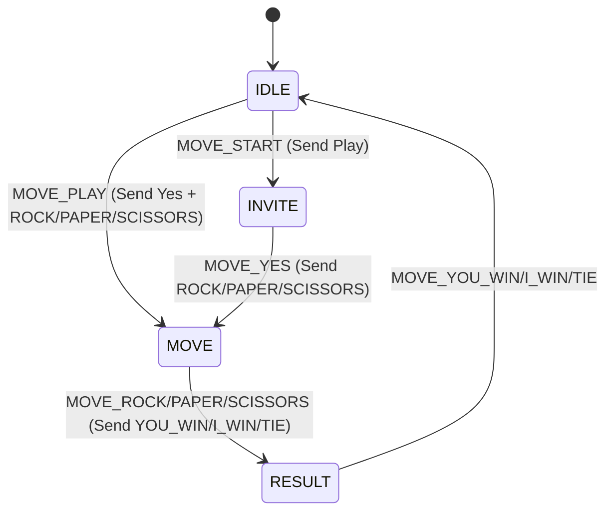

## Game
(c) Alan Ludwig, All rights reserved 

A game of rock-paper-scissors

## Total Vocabulary
    PLAY: PL
    YES: YE
    ROCK: R
    PAPER : PA
    SCISSORS: SC
    YOU WIN: YO
    I WIN: I
    TIE: T

Command Parser
